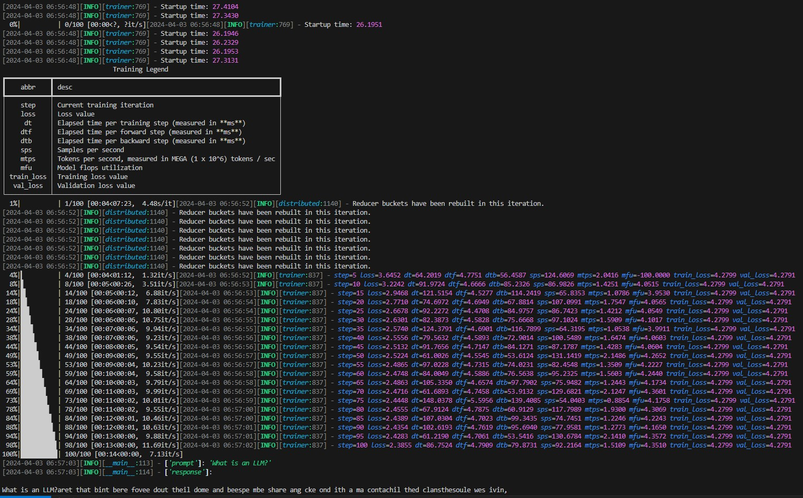
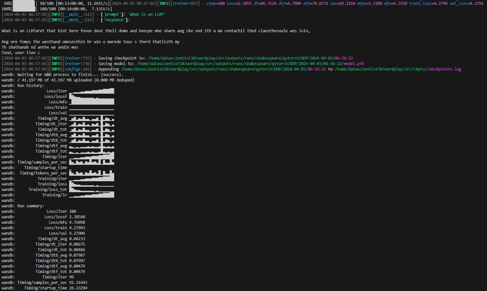
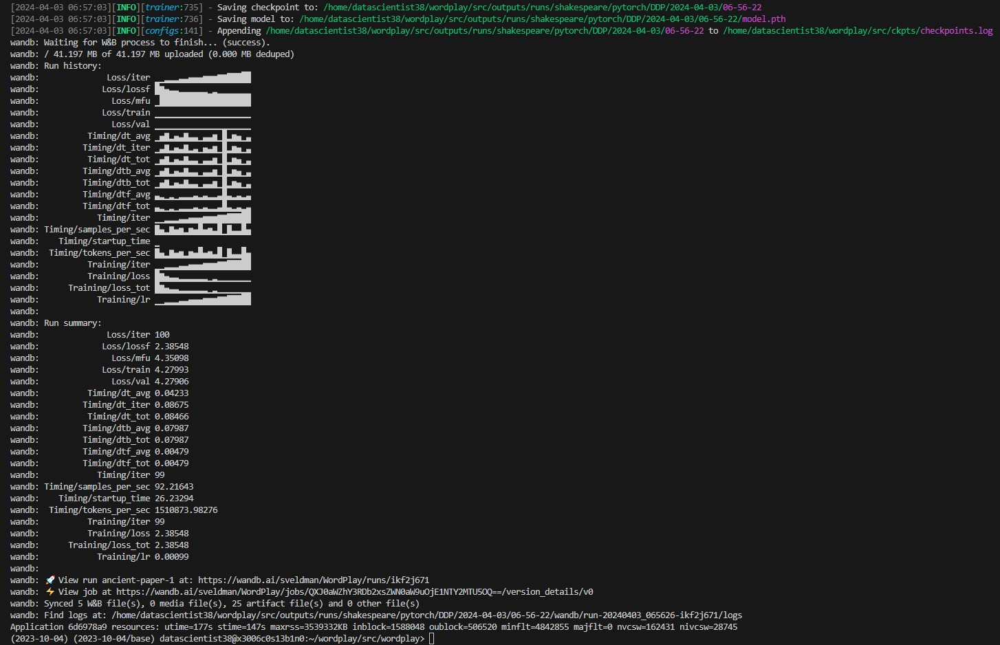

# Parallel Training Methods

Here are links to my W&B run and project, as well as some screenshots of the output from running this on Polaris:

10. \[**Homework**\] Submission:
    - Link to W&B run:
    https://wandb.ai/sveldman/WordPlay/runs/ikf2j671?nw=nwuserstephenveldman

    - Link to W&B project:
    https://wandb.ai/sveldman/WordPlay?nw=nwuserstephenveldman

    - 
    - 
    - 
